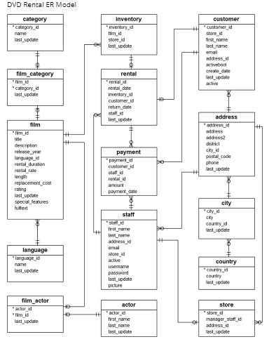
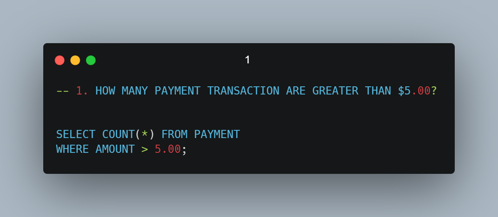
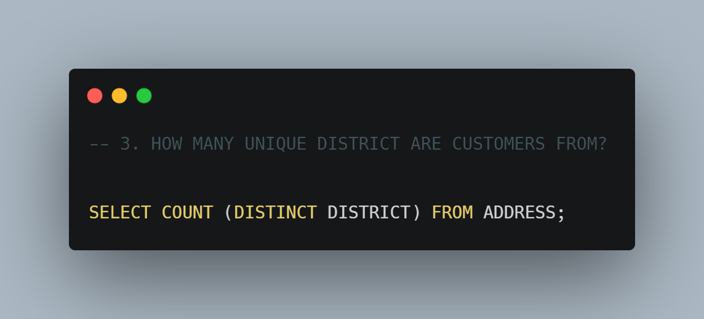
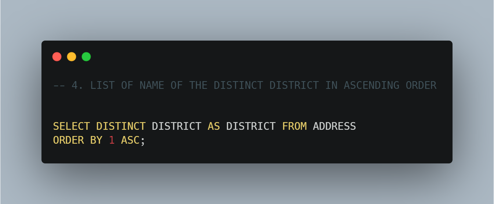
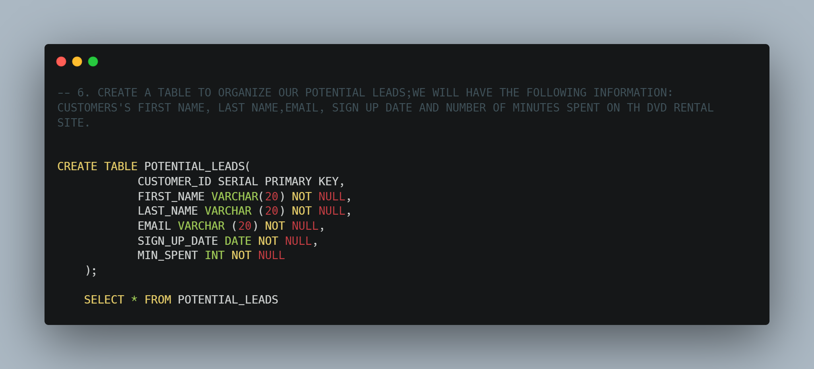
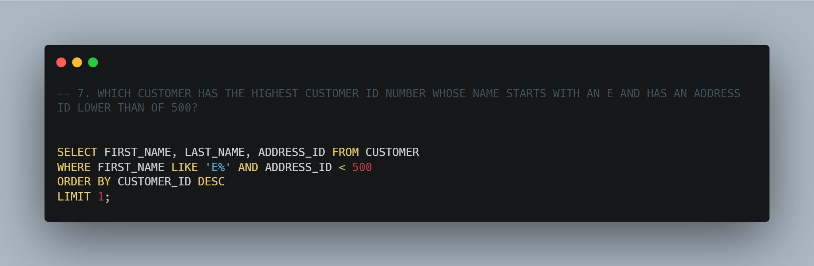
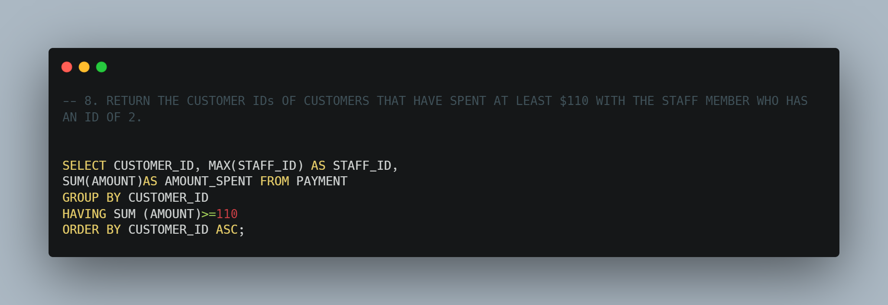
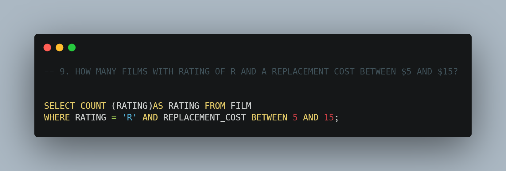
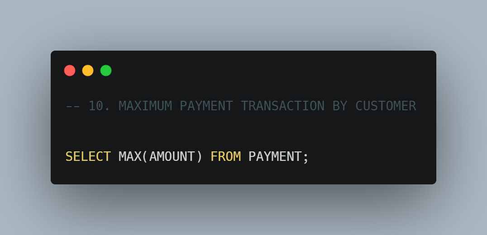
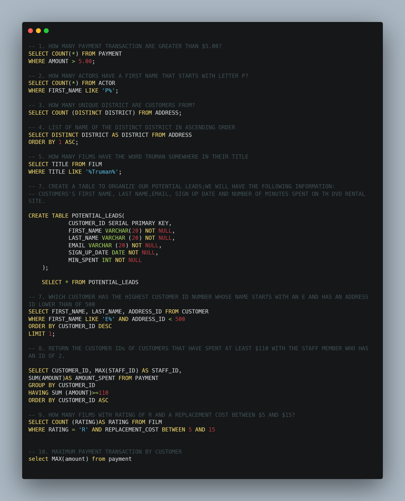

# DVDRENTAL-SQL-ANALYSIS

## INTRODUCTION
The DVD rental database represents the business processes of a DVD rental store consisting of 15 tables. The model of database was carefully studied for indept understanding and familairization before querying. 

## LIST OF TABLES
Below are the list of tables present in the database
- **Actor**
- **Film** 
- **Film_actor** 
- **Category**
- **Film_category** 
- **Store**
- **Inventory** 
- **Rental**
- **Payment** 
- **Staff** 
- **Customer** 
- **Address**
- **City** 
- **Country**

## The following questions were answered in this project
1. How many payment transactions are graeter than $5.00?

2. How many actors have a first name that start with letter 'P'?
                

3. How many unique districts are the customers from?
               

4. List the name of the district in ascending order.
             

5. How many films have the word Truman somewhere in ther title?
               

6.  Create a table to organkse our potential leads; we will have the following information, Customers first name, last name, Email, Sign up date,and number of minutes spent on DVD rental website.
               

7. Which customer has the highest customer ID number,whose name start with 'E' and has an addres ID LOWER THAN 500?
                

8. Return the Cuystomer IDs of customers that have spent at least $110 with the staff member who has an ID of 2.
              

9. How many films with Rating of 'R' and a replacement cost between $5 and $15?
                

10. Maximun payment transaction by customers. 
               

## THE COMPLETE SHEET
            

